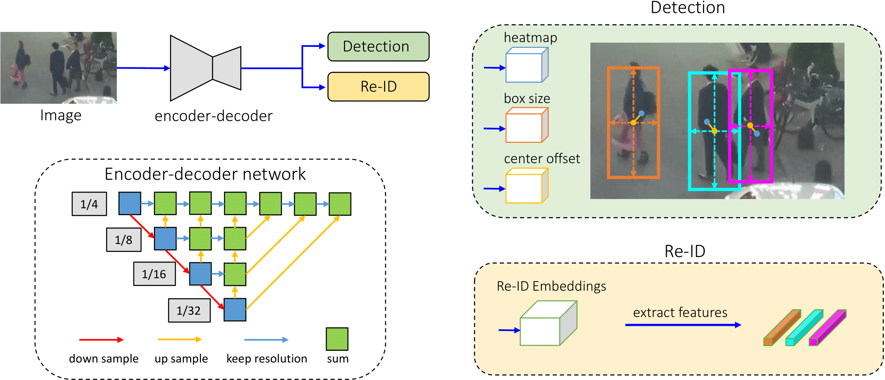

# FairMOT
[](https://paperswithcode.com/sota/multi-object-tracking-on-2dmot15-1?p=a-simple-baseline-for-multi-object-tracking)
[](https://paperswithcode.com/sota/multi-object-tracking-on-mot16?p=a-simple-baseline-for-multi-object-tracking)
[](https://paperswithcode.com/sota/multi-object-tracking-on-mot17?p=a-simple-baseline-for-multi-object-tracking)
[](https://paperswithcode.com/sota/multi-object-tracking-on-mot20-1?p=a-simple-baseline-for-multi-object-tracking)

A simple baseline for one-shot multi-object tracking:

> [**FairMOT: On the Fairness of Detection and Re-Identification in Multiple Object Tracking**](http://arxiv.org/abs/2004.01888),            
> Yifu Zhang, Chunyu Wang, Xinggang Wang, Wenjun Zeng, Wenyu Liu,        
> *IJCV2021 ([arXiv 2004.01888](http://arxiv.org/abs/2004.01888))*
## Abstract
There has been remarkable progress on object detection and re-identification in recent years which are the core components for multi-object tracking. However, little attention has been focused on accomplishing the two tasks in a single network to improve the inference speed. The initial attempts along this path ended up with degraded results mainly because the re-identification branch is not appropriately learned. In this work, we study the essential reasons behind the failure, and accordingly present a simple baseline to addresses the problems. It remarkably outperforms the state-of-the-arts on the MOT challenge datasets at 30 FPS. We hope this baseline could inspire and help evaluate new ideas in this field.

## News
* (2021.08.03) Our paper is accepted by IJCV!
* (2021.06.01) A [nice re-implementation](https://github.com/PaddlePaddle/PaddleDetection/tree/release/2.1/configs/mot) by Baidu [PaddleDetection](https://github.com/PaddlePaddle/PaddleDetection)!
* (2021.05.24) A light version of FairMOT using yolov5s backbone is released! 
* (2020.09.10) A new version of FairMOT is released! (73.7 MOTA on MOT17)

## Main updates
* We pretrain FairMOT on the CrowdHuman dataset using a weakly-supervised learning approach.
* To detect bounding boxes outside the image, we use left, top, right and bottom (4 channel) to replace the WH head (2 channel). 

## Tracking performance
### Results on MOT challenge test set
| Dataset    |  MOTA | IDF1 | IDS | MT | ML | FPS |
|--------------|-----------|--------|-------|----------|----------|--------|
|2DMOT15  | 60.6 | 64.7 |  591 | 47.6% | 11.0% | 30.5 |
|MOT16       | 74.9 | 72.8 | 1074 | 44.7% | 15.9% | 25.9 |
|MOT17       | 73.7 | 72.3 | 3303 | 43.2% | 17.3% | 25.9 |
|MOT20       | 61.8 | 67.3 | 5243 | 68.8% | 7.6% | 13.2 |

 All of the results are obtained on the [MOT challenge](https://motchallenge.net) evaluation server under the “private detector” protocol. We rank first among all the trackers on 2DMOT15, MOT16, MOT17 and  MOT20. The tracking speed of the entire system can reach up to **30 FPS**.

### Video demos on MOT challenge test set
   
   


## Installation
* Clone this repo, and we'll call the directory that you cloned as ${FAIRMOT_ROOT}
* Install dependencies. We use python 3.8 and pytorch >= 1.7.0
```
conda create -n FairMOT
conda activate FairMOT
conda install pytorch==1.7.0 torchvision==0.8.0 cudatoolkit=10.2 -c pytorch
cd ${FAIRMOT_ROOT}
pip install cython
pip install -r requirements.txt
```
* We use [DCNv2_pytorch_1.7](https://github.com/ifzhang/DCNv2/tree/pytorch_1.7) in our backbone network (pytorch_1.7 branch). Previous versions can be found in [DCNv2](https://github.com/CharlesShang/DCNv2).
```
git clone -b pytorch_1.7 https://github.com/ifzhang/DCNv2.git
cd DCNv2
./make.sh
```
* In order to run the code for demos, you also need to install [ffmpeg](https://www.ffmpeg.org/).

## Data preparation

* **CrowdHuman**
The CrowdHuman dataset can be downloaded from their [official webpage](https://www.crowdhuman.org). After downloading, you should prepare the data in the following structure:
```
crowdhuman
   |——————images
   |        └——————train
   |        └——————val
   └——————labels_with_ids
   |         └——————train(empty)
   |         └——————val(empty)
   └------annotation_train.odgt
   └------annotation_val.odgt
```
If you want to pretrain on CrowdHuman (we train Re-ID on CrowdHuman), you can change the paths in src/gen_labels_crowd_id.py and run:
```
cd src
python gen_labels_crowd_id.py
```
If you want to add CrowdHuman to the MIX dataset (we do not train Re-ID on CrowdHuman), you can change the paths in src/gen_labels_crowd_det.py and run:
```
cd src
python gen_labels_crowd_det.py
```
* **MIX**
We use the same training data as [JDE](https://github.com/Zhongdao/Towards-Realtime-MOT) in this part and we call it "MIX". Please refer to their [DATA ZOO](https://github.com/Zhongdao/Towards-Realtime-MOT/blob/master/DATASET_ZOO.md) to download and prepare all the training data including Caltech Pedestrian, CityPersons, CUHK-SYSU, PRW, ETHZ, MOT17 and MOT16. 
* **2DMOT15 and MOT20** 
[2DMOT15](https://motchallenge.net/data/2D_MOT_2015/) and [MOT20](https://motchallenge.net/data/MOT20/) can be downloaded from the official webpage of MOT challenge. After downloading, you should prepare the data in the following structure:
```
MOT15
   |——————images
   |        └——————train
   |        └——————test
   └——————labels_with_ids
            └——————train(empty)
MOT20
   |——————images
   |        └——————train
   |        └——————test
   └——————labels_with_ids
            └——————train(empty)
```
Then, you can change the seq_root and label_root in src/gen_labels_15.py and src/gen_labels_20.py and run:
```
cd src
python gen_labels_15.py
python gen_labels_20.py
```
to generate the labels of 2DMOT15 and MOT20. The seqinfo.ini files of 2DMOT15 can be downloaded here [[Google]](https://drive.google.com/open?id=1kJYySZy7wyETH4fKMzgJrYUrTfxKlN1w), [[Baidu],code:8o0w](https://pan.baidu.com/s/1zb5tBW7-YTzWOXpd9IzS0g).

## Pretrained models and baseline model
* **Pretrained models**

DLA-34 COCO pretrained model: [DLA-34 official](https://drive.google.com/file/d/1pl_-ael8wERdUREEnaIfqOV_VF2bEVRT/view).
HRNetV2 ImageNet pretrained model: [HRNetV2-W18 official](https://1drv.ms/u/s!Aus8VCZ_C_33cMkPimlmClRvmpw), [HRNetV2-W32 official](https://1drv.ms/u/s!Aus8VCZ_C_33dYBMemi9xOUFR0w).
After downloading, you should put the pretrained models in the following structure:
```
${FAIRMOT_ROOT}
   └——————models
           └——————ctdet_coco_dla_2x.pth
           └——————hrnetv2_w32_imagenet_pretrained.pth
           └——————hrnetv2_w18_imagenet_pretrained.pth
```
* **Baseline model**

Our baseline FairMOT model (DLA-34 backbone) is pretrained on the CrowdHuman for 60 epochs with the self-supervised learning approach and then trained on the MIX dataset for 30 epochs. The models can be downloaded here: 
crowdhuman_dla34.pth [[Google]](https://drive.google.com/file/d/1SFOhg_vos_xSYHLMTDGFVZBYjo8cr2fG/view?usp=sharing) [[Baidu, code:ggzx ]](https://pan.baidu.com/s/1JZMCVDyQnQCa5veO73YaMw) [[Onedrive]](https://microsoftapc-my.sharepoint.com/:u:/g/personal/v-yifzha_microsoft_com/EUsj0hkTNuhKkj9bo9kE7ZsBpmHvqDz6DylPQPhm94Y08w?e=3OF4XN).
fairmot_dla34.pth [[Google]](https://drive.google.com/file/d/1iqRQjsG9BawIl8SlFomMg5iwkb6nqSpi/view?usp=sharing) [[Baidu, code:uouv]](https://pan.baidu.com/s/1H1Zp8wrTKDk20_DSPAeEkg) [[Onedrive]](https://microsoftapc-my.sharepoint.com/:u:/g/personal/v-yifzha_microsoft_com/EWHN_RQA08BDoEce_qFW-ogBNUsb0jnxG3pNS3DJ7I8NmQ?e=p0Pul1). (This is the model we get 73.7 MOTA on the MOT17 test set. )
After downloading, you should put the baseline model in the following structure:
```
${FAIRMOT_ROOT}
   └——————models
           └——————fairmot_dla34.pth
           └——————...
```

## Training
* Download the training data
* Change the dataset root directory 'root' in src/lib/cfg/data.json and 'data_dir' in src/lib/opts.py
* Pretrain on CrowdHuman and train on MIX:
```
sh experiments/crowdhuman_dla34.sh
sh experiments/mix_ft_ch_dla34.sh
```
* Only train on MIX:
```
sh experiments/mix_dla34.sh
```
* Only train on MOT17:
```
sh experiments/mot17_dla34.sh
```
* Finetune on 2DMOT15 using the baseline model:
```
sh experiments/mot15_ft_mix_dla34.sh
```
* Train on MOT20:
The data annotation of MOT20 is a little different from MOT17, the coordinates of the bounding boxes are all inside the image, so we need to uncomment line 313 to 316 in the dataset file src/lib/datasets/dataset/jde.py:
```
#np.clip(xy[:, 0], 0, width, out=xy[:, 0])
#np.clip(xy[:, 2], 0, width, out=xy[:, 2])
#np.clip(xy[:, 1], 0, height, out=xy[:, 1])
#np.clip(xy[:, 3], 0, height, out=xy[:, 3])
```
Then, we can train on the mix dataset and finetune on MOT20:
```
sh experiments/crowdhuman_dla34.sh
sh experiments/mix_ft_ch_dla34.sh
sh experiments/mot20_ft_mix_dla34.sh
```
The MOT20 model 'mot20_fairmot.pth' can be downloaded here: [[Google]](https://drive.google.com/file/d/1HVzDTrYSSZiVqExqG9rou3zZXX1-GGQn/view?usp=sharing) [[Baidu, code:jmce]](https://pan.baidu.com/s/1bpMtu972ZszsBx4TzIT_CA).
* For ablation study, we use MIX and half of MOT17 as training data, you can use different backbones such as ResNet, ResNet-FPN, HRNet and DLA::
```
sh experiments/mix_mot17_half_dla34.sh
sh experiments/mix_mot17_half_hrnet18.sh
sh experiments/mix_mot17_half_res34.sh
sh experiments/mix_mot17_half_res34fpn.sh
sh experiments/mix_mot17_half_res50.sh
```
The ablation study model 'mix_mot17_half_dla34.pth' can be downloaded here: [[Google]](https://drive.google.com/file/d/1dJDGSa6-FMq33XY-cOd_nYxuilv30YDM/view?usp=sharing) [[Onedrive]](https://microsoftapc-my.sharepoint.com/:u:/g/personal/v-yifzha_microsoft_com/ESh1SlUvZudKgUX4A8E3yksBhfRHIf2AsKaaPJ-v_5lVAw?e=NB6UHR) [[Baidu, code:iifa]](https://pan.baidu.com/s/1RQD8ik1labWuwd8jJ-0ukQ).
* Performance on the test set of MOT17 when using different training data:

| Training Data    |  MOTA | IDF1 | IDS     |
|--------------|-----------|--------|-------|
|MOT17  | 69.8 | 69.9 | 3996                |
|MIX       | 72.9 | 73.2 | 3345             |
|CrowdHuman + MIX     | 73.7 | 72.3 | 3303  |
* We use CrowdHuman, MIX and MOT17 to train the light version of FairMOT using yolov5s as backbone:
```
sh experiments/all_yolov5s.sh
```
The pretrained model of yolov5s on the COCO dataset can be downloaded here:  [[Google]](https://drive.google.com/file/d/1Ur3_pa9r3KRY-5qM2cdFhFJ5exghRJvh/view?usp=sharing) [[Baidu, code:wh9h]](https://pan.baidu.com/s/1JHjN_l1nkMnRHRF5TcHYXg).

The model of the light version 'fairmot_yolov5s' can be downloaded here:  [[Google]](https://drive.google.com/file/d/1MEvsRPyoAqYSCdKaS5Ofrl7ZfKbBZ1Jb/view?usp=sharing) [[Baidu, code:2y3a]](https://pan.baidu.com/s/1dyBEeiGpRfZhqae0c264rg).

## Tracking
* The default settings run tracking on the validation dataset from 2DMOT15. Using the baseline model, you can run:
```
cd src
python track.py mot --load_model ../models/fairmot_dla34.pth --conf_thres 0.6
```
to see the tracking results (76.5 MOTA and 79.3 IDF1 using the baseline model). You can also set save_images=True in src/track.py to save the visualization results of each frame. 
* For ablation study, we evaluate on the other half of the training set of MOT17, you can run:
```
cd src
python track_half.py mot --load_model ../exp/mot/mix_mot17_half_dla34.pth --conf_thres 0.4 --val_mot17 True
```
If you use our pretrained model 'mix_mot17_half_dla34.pth', you can get 69.1 MOTA and 72.8 IDF1. 
* To get the txt results of the test set of MOT16 or MOT17, you can run:
```
cd src
python track.py mot --test_mot17 True --load_model ../models/fairmot_dla34.pth --conf_thres 0.4
python track.py mot --test_mot16 True --load_model ../models/fairmot_dla34.pth --conf_thres 0.4
```
* To run tracking using the light version of FairMOT (68.5 MOTA on the test of MOT17), you can run:
```
cd src
python track.py mot --test_mot17 True --load_model ../models/fairmot_yolov5s.pth --conf_thres 0.4 --arch yolo --reid_dim 64
```
and send the txt files to the [MOT challenge](https://motchallenge.net) evaluation server to get the results. (You can get the SOTA results 73+ MOTA on MOT17 test set using the baseline model 'fairmot_dla34.pth'.)

* To get the SOTA results of 2DMOT15 and MOT20, run the tracking code:
```
cd src
python track.py mot --test_mot15 True --load_model your_mot15_model.pth --conf_thres 0.3
python track.py mot --test_mot20 True --load_model your_mot20_model.pth --conf_thres 0.3
```
Results of the test set all need to be evaluated on the MOT challenge server. You can see the tracking results on the training set by setting --val_motxx True and run the tracking code. We set 'conf_thres' 0.4 for MOT16 and MOT17. We set 'conf_thres' 0.3 for 2DMOT15 and MOT20. 

## Demo
You can input a raw video and get the demo video by running src/demo.py and get the mp4 format of the demo video:
```
cd src
python demo.py mot --load_model ../models/fairmot_dla34.pth --conf_thres 0.4
```
You can change --input-video and --output-root to get the demos of your own videos.
--conf_thres can be set from 0.3 to 0.7 depending on your own videos.

## Train on custom dataset
You can train FairMOT on custom dataset by following several steps bellow:
1. Generate one txt label file for one image. Each line of the txt label file represents one object. The format of the line is: "class id x_center/img_width y_center/img_height w/img_width h/img_height". You can modify src/gen_labels_16.py to generate label files for your custom dataset.
2. Generate files containing image paths. The example files are in src/data/. Some similar code can be found in src/gen_labels_crowd.py
3. Create a json file for your custom dataset in src/lib/cfg/. You need to specify the "root" and "train" keys in the json file. You can find some examples in src/lib/cfg/.
4. Add --data_cfg '../src/lib/cfg/your_dataset.json' when training. 

## Acknowledgement
A large part of the code is borrowed from [Zhongdao/Towards-Realtime-MOT](https://github.com/Zhongdao/Towards-Realtime-MOT) and [xingyizhou/CenterNet](https://github.com/xingyizhou/CenterNet). Thanks for their wonderful works.

## Citation

```
@article{zhang2021fairmot,
  title={Fairmot: On the fairness of detection and re-identification in multiple object tracking},
  author={Zhang, Yifu and Wang, Chunyu and Wang, Xinggang and Zeng, Wenjun and Liu, Wenyu},
  journal={International Journal of Computer Vision},
  pages={1--19},
  year={2021},
  publisher={Springer}
}
```

